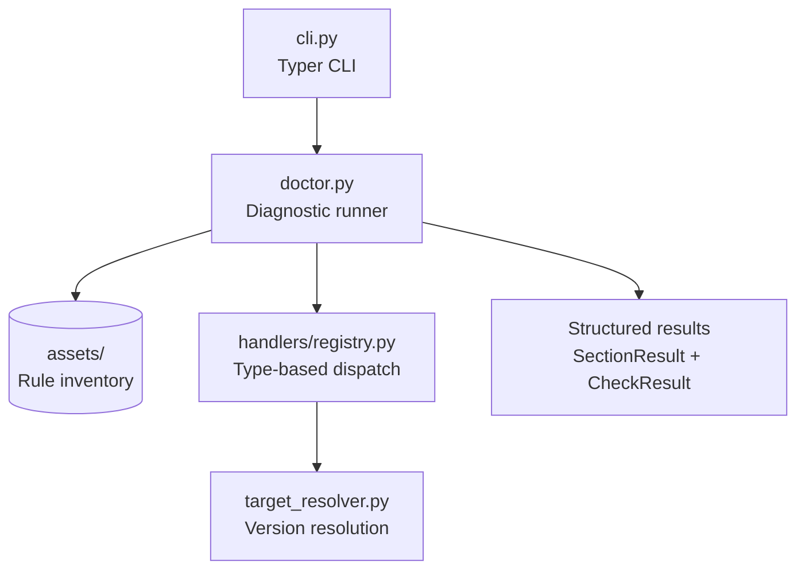

# DESIGN.md

Design Principles for `azure-functions-doctor`

## Purpose

This document defines the architectural boundaries and design principles of the project.

## Design Goals

- Diagnose common Azure Functions Python v2 project issues quickly.
- Keep checks explicit, understandable, and easy to extend.
- Provide CLI output that is useful for both local troubleshooting and CI automation.
- Stay small enough to act as a utility rather than a framework.

## Non-Goals

This project does not aim to:

- Replace Azure Functions tooling or local emulation
- Modify user projects automatically
- Manage deployment or infrastructure
- Support the legacy `function.json`-based Python v1 model

## Design Principles

- Checks should report facts, not hide them behind abstractions.
- Rule output should remain readable in both human and machine contexts.
- Optional checks must not interfere with required checks.
- Public CLI behavior should evolve conservatively.
- Example projects should model supported project layouts.

## Integration Boundaries

- Runtime validation belongs to `azure-functions-validation`.
- OpenAPI generation belongs to `azure-functions-openapi`.
- This repository owns project inspection, rule execution, and diagnostic reporting.

## Compatibility Policy

- Minimum supported Python version: `3.10`
- Supported runtime target: Azure Functions Python v2 programming model
- Public APIs and CLI behavior follow semantic versioning expectations

## Change Discipline

- New checks require tests and example coverage when applicable.
- Output format changes are user-facing behavior changes.
- Experimental checks or flags must be clearly labeled in code and docs.

## High-Level Architecture

## Sources

- [Azure Functions Python developer reference](https://learn.microsoft.com/en-us/azure/azure-functions/functions-reference-python)
- [Azure Functions host.json reference](https://learn.microsoft.com/en-us/azure/azure-functions/functions-host-json)
- [Supported languages in Azure Functions](https://learn.microsoft.com/en-us/azure/azure-functions/supported-languages)

## See Also

- [azure-functions-validation — Architecture](https://github.com/yeongseon/azure-functions-validation) — Request/response validation pipeline
- [azure-functions-openapi — Architecture](https://github.com/yeongseon/azure-functions-openapi) — OpenAPI spec generation
- [azure-functions-logging — Architecture](https://github.com/yeongseon/azure-functions-logging) — Structured logging with contextvars
- [azure-functions-scaffold — Architecture](https://github.com/yeongseon/azure-functions-scaffold) — Project scaffolding CLI
- [azure-functions-langgraph — Architecture](https://github.com/yeongseon/azure-functions-langgraph) — LangGraph agent deployment
