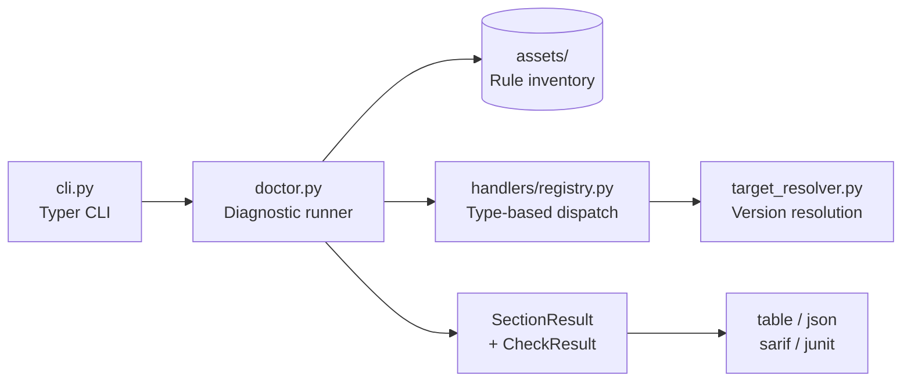

# Azure Functions Doctor

> Part of the **Azure Functions Python DX Toolkit** — dogfood-tested by [azure-functions-cookbook-python](https://github.com/yeongseon/azure-functions-cookbook-python).

[](https://pypi.org/project/azure-functions-doctor/)
[](https://pepy.tech/project/azure-functions-doctor)
[](https://pypi.org/project/azure-functions-doctor/)
[](https://github.com/yeongseon/azure-functions-doctor-python/actions/workflows/ci-test.yml)
[](https://github.com/yeongseon/azure-functions-doctor-python/actions/workflows/publish-pypi.yml)
[](https://github.com/yeongseon/azure-functions-doctor-python/actions/workflows/security.yml)
[](https://codecov.io/gh/yeongseon/azure-functions-doctor-python)
[](https://pre-commit.com/)
[](https://yeongseon.dev/azure-functions-python/doctor/)
[](LICENSE)

Read this in: [한국어](README.ko.md) | [日本語](README.ja.md) | [简体中文](README.zh-CN.md)

**Azure Functions Doctor** is the pre-deploy health gate for **Azure Functions Python v2** projects — a diagnostic CLI that catches configuration issues, missing dependencies, and environment problems before they cause runtime failures in production.

> **Looking for the official `azure-functions-skills` doctor?** This is an independent, offline, deterministic Python package — see [how it compares](docs/comparison.md) and when to use each.

---

Part of the **Azure Functions Python DX Toolkit**
→ Bring FastAPI-like developer experience to Azure Functions

## Why this exists

Deploying a broken Azure Functions app is expensive — the worker starts, the host reads config, and only then does it surface the issue in a production log. Common problems that slip through:

- **Missing dependencies** — `azure-functions` not in `requirements.txt`, discovered only at cold start
- **Invalid configuration** — `host.json` misconfigured, `extensionBundle` missing or outdated
- **Runtime incompatibilities** — Python version mismatch with Azure Functions runtime
- **Silent failures** — no virtual environment, Core Tools not installed, Application Insights key missing

`azure-functions-doctor` moves that failure left — catch it locally or in CI, not in production.

## What it does

- **41 diagnostic checks** — Python version, dependencies, host.json, Core Tools, Durable Functions, and more
- **Multiple output formats** — table, JSON, SARIF, JUnit for CI integration
- **Profile support** — `minimal`, `deploy`, `development`, or `full` rulesets depending on your needs
- **Official GitHub Action** — `yeongseon/azure-functions-doctor@v1` for CI gates

## Scope

This repository targets the decorator-based Azure Functions Python v2 programming model only.
Non-v2 repositories are detected up front and reported as unsupported instead of running v2-only checks.

- Supported model: `func.FunctionApp()` with decorators such as `@app.route()`
- Unsupported model: legacy `function.json`-based Python v1 projects

Use `azure-functions-doctor` as part of a pre-deployment checklist alongside [azure-functions-logging](https://github.com/yeongseon/azure-functions-logging-python) for observability.

## What this package does not do

This package does not own:

- **Fixing issues** — it diagnoses configuration problems but does not auto-fix them
- **API documentation** — use [`azure-functions-openapi`](https://github.com/yeongseon/azure-functions-openapi-python) for API documentation and spec generation
- **Request validation** — use [`azure-functions-validation`](https://github.com/yeongseon/azure-functions-validation-python) for request/response validation and serialization

## Installation

From PyPI:

```bash
pip install azure-functions-doctor
```

From source:

```bash
git clone https://github.com/yeongseon/azure-functions-doctor-python.git
cd azure-functions-doctor-python
python3 -m venv .venv
source .venv/bin/activate
pip install -e .
```

## Quick Start

**3 minutes, install to first fixed finding.** Clone this repo (for the demo
fixture), install, run the doctor on a project that ships a real deploy-risk
bug, then fix what it points at:

```bash
pip install azure-functions-doctor
git clone https://github.com/yeongseon/azure-functions-doctor-python.git
cd azure-functions-doctor-python

# 1) Run the doctor on a broken fixture (dev-storage emulator leaked into infra)
azure-functions-doctor doctor --path examples/v2/broken-dev-storage-leak

# 2) Read the finding — it names the file, the risk, and the fix:
#    Dev-storage emulator connection in deployable config (ships to production):
#    - main.bicep
#    Fix: provision a real storage account connection ...

# 3) Fix it: point AzureWebJobsStorage at a real storage account in main.bicep,
#    keep UseDevelopmentStorage=true only in local.settings.json. Re-run:
#    the warning is gone and the exit code returns to 0.
```

Exit codes make it a CI gate: `0` when required checks pass, `1` on any
required failure; optional findings warn without gating (`--profile` selects
`minimal` / `deploy` / `development` / `full`, [details](#what-it-does)).

Run the doctor in the current project:

```bash
azure-functions-doctor doctor
```

Run against a specific project:

```bash
azure-functions-doctor doctor --path ./examples/v2/http-trigger
```

Use a required-only profile:

```bash
azure-functions-doctor doctor --profile minimal
```

Output JSON for CI:

```bash
azure-functions-doctor doctor --format json
```

Pin the Azure Functions target runtime explicitly:

```bash
azure-functions-doctor doctor --target-python 3.12
```

Use `--target-python` when the Python running `azure-functions-doctor`
is not the same as the Python version your Function App will run on Azure.

### Project configuration (`pyproject.toml`)

For per-project defaults, add a `[tool.azure-functions-doctor]` table to your
`pyproject.toml`. This is a deliberately minimal surface for suppressing rules
and scoping the scan:

```toml
[tool.azure-functions-doctor]
# Rule ids to suppress. Suppressed rules are reported with the `skip`
# status (never silently passed).
ignore = ["check_application_insights", "check_core_tools"]

# Extra path globs to exclude from scans, layered on top of the built-in
# excluded directories (`.venv`, `node_modules`, `build`, ...). Globs are
# matched against each path relative to the project root.
exclude = ["legacy", "vendor/*.py"]
```

**Precedence.** CLI flags take precedence over configuration: `--profile` and
`--rules` select the ruleset, and the config `ignore`/`exclude` then layer on
top of the resolved run. Ignored rules that survive profile filtering are
reported as `skip` rather than executed. There is no CLI equivalent for
`ignore`/`exclude` in this minimal surface.

### Command name and deprecated aliases

`azure-functions-doctor` is the **canonical** command. Two legacy console-script
aliases still work but are **deprecated** and print a warning when invoked:

| Command | Status |
| --- | --- |
| `azure-functions-doctor` | Canonical — use this. |
| `azure-functions` | Deprecated — removal targeted for **v1.0.0**. |
| `fdoctor` | Deprecated — removal targeted for **v1.0.0**. |

Migrate any scripts or CI pipelines to `azure-functions-doctor` before the
v1.0.0 release removes the aliases.

See the [deprecated aliases migration guide](docs/deprecated-aliases.md) for
step-by-step examples covering shell scripts, GitHub Actions, Makefiles, and
pre-commit hooks.

### Sample output (excerpt)

```bash
azure-functions-doctor doctor --path ./examples/v2/http-trigger
```

```text
Azure Functions Doctor
Path: ./examples/v2/http-trigger

Programming Model
[✓] Programming model v2: Keyword '@app.|@bp.' found in source code (AST)

Python Env
[✓] Python version: Python 3.10.12 (tool runtime, >=3.10)
[✓] requirements.txt: requirements.txt exists
[✓] azure-functions package: Package 'azure-functions' declared in requirements.txt

Project Structure
[✓] host.json: host.json exists
[✓] host.json version: host.json version is "2.0"

Tooling
[✓] Azure Functions Core Tools (func): func detected

...

Doctor summary:
  0 fails, 5 warnings, 15 passed
Exit code: 0
```

The same command runs in CI pipelines — see [CI Integration](#ci-integration) below and [docs/deployment.md](docs/deployment.md) for details.

## CI Integration

**Recipe — gate a PR job on the deploy profile** (exit 1 only on required
failures; optional findings warn in the log):

```yaml
- name: Pre-deploy health gate
  run: |
    pip install "azure-functions-doctor>=0.20,<1"
    azure-functions-doctor doctor --path . --profile deploy --format junit --output doctor.xml
```

**Recipe — official GitHub Action with Code Scanning** (see
[docs/examples/ci_integration.md](docs/examples/ci_integration.md) for the
full set: Azure DevOps, pre-commit, VS Code, and a minimal SARIF recipe):

```yaml
- uses: yeongseon/azure-functions-doctor@v1
  with:
    path: .
    profile: deploy
    format: sarif
    output: doctor.sarif
    upload-sarif: true
```

## GitHub Actions (CLI)

```yaml
- name: Run azure-functions-doctor
  run: |
    pip install azure-functions-doctor
    azure-functions-doctor doctor --profile minimal --format json --output doctor.json

- name: Upload report
  if: always()
  uses: actions/upload-artifact@v4
  with:
    name: doctor-report
    path: doctor.json
```

### Official GitHub Action

```yaml
- uses: yeongseon/azure-functions-doctor@v1
  with:
    path: .
    profile: minimal
    format: sarif
    output: doctor.sarif
    upload-sarif: "true"
```

See [docs/examples/ci_integration.md](docs/examples/ci_integration.md) for Azure DevOps, pre-commit, VS Code, and SARIF upload examples — including a [minimal copy-paste SARIF → GitHub code scanning recipe](docs/examples/ci_integration.md#minimal-copy-paste-recipe-official-action).

## Demo

The demo below is generated from [`demo/doctor-demo.tape`](demo/doctor-demo.tape) with VHS.
It runs the real `azure-functions-doctor doctor` CLI against the representative example
and then against an intentionally broken copy to show the pass/fail contrast.


The final terminal state is also captured as a static image for quick inspection.


## Default ruleset

The default ruleset includes checks for:

- Azure Functions Python v2 decorator usage
- Python version
- virtual environment activation
- Python executable availability
- `requirements.txt`
- `azure-functions` dependency declaration
- `host.json`
- `local.settings.json` (optional)
- Azure Functions Core Tools presence and version (optional)
- Durable Functions host configuration (optional)
- Application Insights configuration (optional)
- `extensionBundle` configuration (optional)
- ASGI/WSGI callable exposure (optional)
- common unwanted files in the project tree (optional)

## Examples

| Scenario | Example | Demonstrates |
| --- | --- | --- |
| Healthy v2 HTTP app | [http-trigger](examples/v2/http-trigger/README.md) | Reference project; docs/e2e/Action anchor |
| Multi-trigger + blueprint | [multi-trigger](examples/v2/multi-trigger/README.md) | Several trigger kinds in one app |
| Healthy Flex Consumption | [flex-consumption](examples/v2/flex-consumption/README.md) | `functionAppConfig.runtime`, managed-identity deployment storage |
| Unsupported Flex runtime | [broken-flex-runtime-config](examples/v2/broken-flex-runtime-config/README.md) | `check_flex_runtime_config` failure |
| Legacy settings on Flex | [broken-flex-deprecated-settings](examples/v2/broken-flex-deprecated-settings/README.md) | Deprecated app-setting warnings |
| Missing storage auth | [broken-flex-deployment-storage](examples/v2/broken-flex-deployment-storage/README.md) | Deployment-storage shape warnings |
| Emulator leak in infra | [broken-dev-storage-leak](examples/v2/broken-dev-storage-leak/README.md) | `UseDevelopmentStorage=true` shipped in bicep |
| Legacy `~3` pin | [broken-legacy-extension-version](examples/v2/broken-legacy-extension-version/README.md) | Extension-version warn + v3 lifecycle failure |
| Monorepo subdirectory | [monorepo](examples/monorepo/README.md) | SARIF repo-root rebasing (`services/api`) |

## Requirements

- Python 3.10+
- Hatch for development workflows
- Azure Functions Core Tools v4+ recommended for local runs

## When to use

- Before deploying an Azure Functions app (local pre-flight check)
- In CI/CD pipelines as a deployment gate
- When onboarding a new developer to catch environment setup issues
- After upgrading Python version or Azure Functions runtime
- As a pre-commit hook for configuration validation

## How It Works

`azure-functions-doctor doctor` loads a JSON ruleset, dispatches each rule to a
type-based handler, and aggregates the results into per-section output:



See [docs/architecture.md](docs/architecture.md) for the full component and
sequence diagrams, and [docs/diagnostics.md](docs/diagnostics.md) for the
rule-evaluation pipeline.

## Documentation

- [docs/index.md](docs/index.md)
- [docs/usage.md](docs/usage.md)
- [docs/rules.md](docs/rules.md)
- [docs/diagnostics.md](docs/diagnostics.md)
- [docs/development.md](docs/development.md)
- [docs/examples/ci_integration.md](docs/examples/ci_integration.md)

## Ecosystem

This package is part of the **Azure Functions Python DX Toolkit**.

**Design principle:** `azure-functions-doctor` owns pre-deploy diagnostics. It does not fix issues or generate code — it surfaces actionable findings so developers can fix them. Runtime behavior belongs to [`azure-functions-openapi`](https://github.com/yeongseon/azure-functions-openapi-python) (API documentation and spec generation), [`azure-functions-validation`](https://github.com/yeongseon/azure-functions-validation-python) (request/response validation), and [`azure-functions-langgraph`](https://github.com/yeongseon/azure-functions-langgraph-python) (LangGraph runtime exposure).

| Package | Role |
|---------|------|
| [azure-functions-openapi-python](https://github.com/yeongseon/azure-functions-openapi-python) | OpenAPI spec generation and Swagger UI |
| [azure-functions-validation-python](https://github.com/yeongseon/azure-functions-validation-python) | Request/response validation and serialization |
| [azure-functions-db-python](https://github.com/yeongseon/azure-functions-db-python) | SQLAlchemy-powered DB integration helpers (poll-based pseudo trigger, input/output/client injection) |
| [azure-functions-langgraph-python](https://github.com/yeongseon/azure-functions-langgraph-python) | LangGraph deployment adapter for Azure Functions |
| [azure-functions-scaffold-python](https://github.com/yeongseon/azure-functions-scaffold-python) | Project scaffolding CLI |
| [azure-functions-logging-python](https://github.com/yeongseon/azure-functions-logging-python) | Structured logging and observability |
| **azure-functions-doctor-python** | Pre-deploy diagnostic CLI |
| [azure-functions-durable-graph-python](https://github.com/yeongseon/azure-functions-durable-graph-python) | Manifest-first graph runtime with Durable Functions *(experimental)* |
| [azure-functions-knowledge-python](https://github.com/yeongseon/azure-functions-knowledge-python) | Knowledge retrieval (RAG) decorators |
| [azure-functions-cookbook-python](https://github.com/yeongseon/azure-functions-cookbook-python) | Dogfood examples — runnable recipes that exercise the full toolkit |

## For AI Coding Assistants

This repository includes `llms.txt` and `llms-full.txt` for LLM-friendly documentation:

- **`llms.txt`** — Concise index of package info, CLI commands, quick start, and ecosystem overview
- **`llms-full.txt`** — Comprehensive API reference with output formats, diagnostic rules, custom rules, and CI integration patterns

When working with this codebase, LLM assistants should:

1. **Use `llms.txt` for quick reference** — the canonical package version (0.20.0), Python requirements (>=3.10,<3.15), CLI entry points
2. **Refer to `llms-full.txt` for implementation details** — output contracts, rule structure, custom rule patterns, handler types
3. **Check `src/azure_functions_doctor/cli.py`** — authoritative source for CLI options and validation
4. **Review `src/azure_functions_doctor/assets/rules/v2.json`** — complete ruleset with check definitions
5. **Consult `src/azure_functions_doctor/handlers/registry.py`** — diagnostic rule handlers and pattern matchers (`handlers/_helpers.py` for shared primitives)

For bug reports, feature requests, or documentation improvements, please open an issue or pull request on GitHub.

## Disclaimer

This project is an independent community project and is not affiliated with,
endorsed by, or maintained by Microsoft.

Azure and Azure Functions are trademarks of Microsoft Corporation.

## License

MIT
